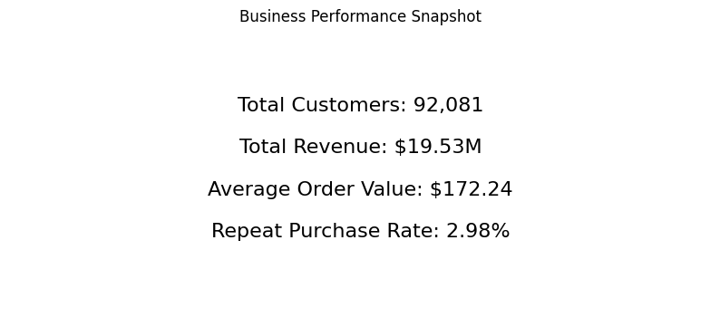
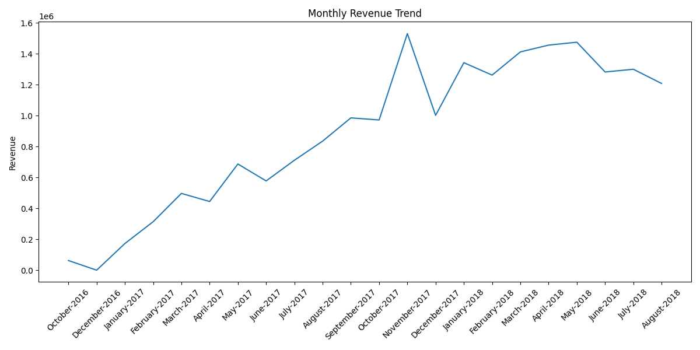
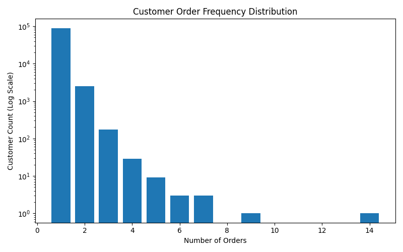
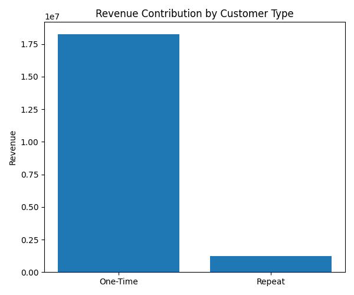

# Product Analytics with SQL: Revenue, Retention, and Customer Behavior

## Overview

This project presents an end-to-end product analytics case study using SQL and Python to analyze customer behavior, revenue trends, retention patterns, and operational performance within a large-scale e-commerce platform.

Using the Brazilian E-Commerce Public Dataset by Olist, the analysis explores how customer acquisition, repeat purchasing behavior, payment methods, delivery performance, and revenue growth contribute to long-term business performance and strategic decision-making.

The project combines:
- SQL-based business analysis
- Python visualization workflows
- KPI reporting
- Revenue and retention analysis
- Window functions and trend analysis
- Executive-style business interpretation

---

## Business Problem

The platform demonstrates strong customer acquisition and revenue generation, but limited visibility into:

- Customer retention and repeat purchasing behavior
- Long-term customer value
- Revenue concentration patterns
- Operational performance impacts
- Geographic and payment-related trends
- Sustainable growth opportunities

The goal of this analysis is to identify the key drivers of customer behavior and uncover strategic opportunities to improve retention, customer lifetime value, and long-term growth.

---

## Data Source

This project uses the **Brazilian E-Commerce Public Dataset by Olist** from Kaggle.

Due to file size limitations, a sampled subset of the dataset is included in this repository for reproducibility and demonstration purposes.

---

## Tools & Technologies

- SQL (SQLite)
- Python
- pandas
- matplotlib
- seaborn
- VS Code

---

## Business Performance Snapshot



### Key KPIs

| KPI | Value |
|---|---|
| Total Customers | 92,081 |
| Total Revenue | $19.53M |
| Average Order Value | $172.24 |
| Repeat Purchase Rate | 2.98% |

### Interpretation

The platform generated more than $19.5M in revenue across over 92k customers, indicating strong acquisition and monetization performance. However, repeat purchasing behavior remained extremely limited, suggesting long-term growth is heavily dependent on continued customer acquisition rather than retention.

---

## Revenue Trend Analysis



### Analysis

Revenue increased substantially throughout 2017 and 2018, indicating strong platform expansion and customer acquisition growth over time.

The trend also demonstrates periods of monthly volatility, suggesting the influence of seasonality, promotional activity, or fluctuating customer demand patterns.

### Key Insight

While revenue growth remained strong overall, the business appears highly acquisition-driven due to weak repeat purchasing behavior.

---

## Customer Retention & Purchase Frequency



### Analysis

The customer base is overwhelmingly composed of one-time purchasers, with repeat purchasing behavior occurring among only a very small subset of users.

A log-scale visualization was used to better illustrate the steep drop-off in repeat purchasing behavior.

### Key Insight

Approximately 97% of customers placed only one order, indicating that customer retention represents a major strategic opportunity for sustainable long-term growth.

---

## Revenue Contribution by Customer Type



### Analysis

Revenue was heavily concentrated among one-time purchasers due to the extremely small repeat customer base.

Despite representing only a small percentage of customers, repeat purchasers still contributed meaningful revenue, suggesting that improving retention could substantially increase customer lifetime value.

### Key Insight

Even modest improvements in repeat purchase behavior could significantly improve long-term revenue efficiency and reduce dependence on customer acquisition.

---

## Payment Method Analysis

### Findings

| Payment Type | Revenue |
|---|---|
| Credit Card | $15.01M |
| Boleto | $3.89M |
| Voucher | $389K |
| Debit Card | $243K |

### Key Insight

Credit cards represented the dominant payment method and generated the majority of total platform revenue, suggesting that checkout optimization and installment-based purchasing behavior may play important roles in customer monetization.

---

## Geographic Revenue Analysis

### Top Revenue-Generating States

| State | Revenue |
|---|---|
| SP | $7.31M |
| RJ | $2.66M |
| MG | $2.26M |
| RS | $1.09M |
| PR | $1.02M |

### Key Insight

Revenue was heavily concentrated geographically, with São Paulo significantly outperforming all other regions. This suggests opportunities for regional growth optimization and expansion into underpenetrated markets.

---

## Delivery Performance Analysis

### Findings

| Delivery Status | Avg Orders per Customer |
|---|---|
| Late | 1.0285 |
| On Time | 1.0335 |

### Analysis

While late deliveries were relatively common, the analysis found only minimal differences in repeat purchasing behavior between customers receiving late versus on-time deliveries.

### Key Insight

The findings suggest that broader customer experience factors beyond delivery timing may play a larger role in long-term retention behavior.

---

## Advanced SQL Analysis

The project incorporates advanced SQL techniques including:

- Common Table Expressions (CTEs)
- Window Functions
- Ranking Functions
- Aggregations
- Time-Series Trend Analysis
- Revenue Growth Calculations

### Example Window Function

```sql
RANK() OVER (
    ORDER BY total_revenue DESC
)
```

### Example Time-Series Analysis

```sql
LAG(revenue) OVER (
    ORDER BY year_of_purchase, month_num
)
```

---

## Strategic Recommendations

- Prioritize customer retention initiatives, as repeat purchasing behavior is extremely limited despite strong customer acquisition.
- Develop post-purchase engagement strategies to encourage second-order conversion and improve customer lifetime value.
- Focus operational and marketing investments on high-performing geographic regions while exploring expansion opportunities in underpenetrated markets.
- Optimize the credit card checkout experience, as credit card transactions account for the majority of platform revenue.
- Continue monitoring fulfillment performance while investigating additional drivers of customer retention beyond delivery timing.

---

## Project Structure

```text
product-analytics-with-sql-revenue-retention-and-customer-behavior/
│
├── data/
│   └── olist_sample.csv
│
├── outputs/
│   ├── business_kpi_snapshot.png
│   ├── monthly_revenue_trend.png
│   ├── customer_order_distribution.png
│   └── revenue_by_customer_type.png
│
├── queries/
│   └── analysis.sql
│
├── src/
│   ├── create_sample.py
│   ├── load_data.py
│   └── visualize.py
│
├── requirements.txt
└── README.md
```

---

## How to Run

### Install dependencies

```bash
pip install -r requirements.txt
```

### Load data into SQLite

```bash
python src/load_data.py
```

### Run visualizations

```bash
python src/visualize.py
```

---

## Key Takeaways

- Strong revenue growth does not necessarily indicate strong customer retention.
- Customer acquisition dominated business performance, while repeat purchasing remained extremely limited.
- SQL can be used not only for querying data, but for uncovering strategic product and growth insights.
- Combining SQL with Python visualization creates a powerful workflow for product analytics and business intelligence.
- Data-driven analysis can help identify actionable opportunities for retention, monetization, and operational improvement.

---

## Author

**Alexandria Green**
